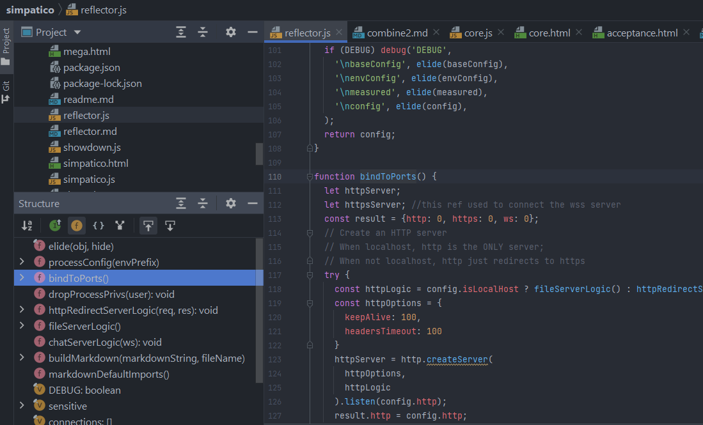

<!--<!DOCTYPE html>
<head>
  <title>Simpatico: reflector.js</title>
  <link class="testable" id="favicon" rel="icon" type="image/svg+xml" href="data:image/svg+xml,
    <svg xmlns='http://www.w3.org/2000/svg' viewBox='0 0 1 1'>
        <rect width='1' height='1' fill='DodgerBlue' />
    </svg>"
  >
  <link rel="stylesheet" href="/style.css">

  <link class="hljs" rel="stylesheet" href="/kata/highlight.github.css">

  <script class="hljs" type="module">
    import hljs from '/kata/highlight.min.js';
    import javascript from '/kata/highlight.javascript.min.js';
    const d=document, elts = a => d.querySelectorAll(a);
    hljs.registerLanguage('javascript', javascript);
    d.addEventListener('DOMContentLoaded', () =>
      elts('pre code').forEach(block =>
        hljs.highlightElement(block)));
  </script>
</head>-->

# Reflector
See: [home](/index.html)

The [reflector](/reflector.js) is the server component of simpatico.
It's a small, almost single file 450 line node program, written in modular, modern style that serves as a:
    1. Websocket server.
    1. Static file server.
    1. [Literate Markdown] renderer.
    1. SSL server.
    1. And more.

## Cache design
In memory, invalidated on file delete or write via chokidar. Turn debug mode on to see cache hits and misses. Data is processed (literate markdown and gzipping) before caching in an attempt to be efficient. For simplicity I gzip all the things even though it's not always necessary and actually is harmful, as with png or jpg images.

Total unique resource size should not exceed 100MB to be on the safe side of my current server who's advertised memory size is 1.0GB but in reality I get 0.5GB usable (to up this would need to switch to Alpine). (it is a very good design constraint to be somewhat limited in size.)

Sadly this command to check worst-case cache pressure in advance is rather slow and takes 1.5s even on a fast machine, otherwise it would be a good `git pre-commit hook`:

```bash
 find . -type f -not -path './.*' -exec du -b {} + | awk '{s+=$1} END {if (s > 100 * 1024 * 1024) print "Total addressable resource size exceeds
100MB"; else print s}'
```

## Reflector Runner
Testing the reflector, particularly the cache functionality, which was giving me trouble, it turned out because of mismatching keys between write and read.
But I started writing a "wrapper script" that can start a server, send messages, check output, modify the file system, send more messages, check output...and then do it again with a different server instance, probably one started with different parameters.

My first approach was to use bash but I abandoned that approach because it clearly needs a "real" programming language.
Given the rest of the project is in javascript, and reflector is in node, for my next approach I picked node.
So far in this project I've destressed asynchronous constructs, preferring the simplest static one-shot callback functions, and the node implementation started pushing against the limits of this approach.
I rethought things and turned back the complexity.
But my work on the runner, which has taken a few days, and has fixed the cache bug, still feels like a waste of time
since I'm paying the price for a radical "NIH" approach.
Mitigating factor is that this may become a good steelman argument for traditional approach to functional testing.
I think the stree has a natural application to functional testing, and I can contrast that implementation with this one.

Enable a BTD loop of the server invocation itself.
Loop through a set of startup configurations.
Interact with the file system, and check the server's response.
A node program that uses fork to start the server, and then uses curl to interact with it.


## Current work

The following goals are currently underspecified and not met:
    1. Do not melt under load,
    1. serve minimal data, efficiently.

The "fast & easy" things we can do are mimic well-known software in this area
like [nginx](https://nginx.org/) or [caddy](https://github.com/caddyserver/caddy).
The basic strategy is to "reduce what you serve" and "serve things efficiently".

To reduce what we serve, we need to add aggressive client caching:
  1. Add cache headers to cache sub-resources forever
  1. Let clients update sub-resources by modifying the URL at runtime
  1. Consider ways to detect and mitigate badly behaved clients.

Additionally, we can make the resources smaller over the wire by using `gzip` (and perhaps `brotli`) to compress the response. Virtually all clients support this compression scheme, and it would also reduce memory pressure in the file cache, so we might want to just replace the plaintext cache with a compressed cache, and do not support non gzip clients.


## Authoring with IntelliJ IDEA
I use IntelliJ IDEA to author my code.
Here is what I see when I open the reflector.js file:



## Projects
